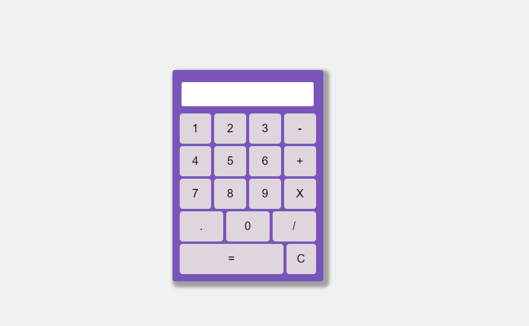

# Calculadora JS

🖩 Projeto de uma calculadora simples em JavaScript, utilizando HTML, CSS e Flexbox para a interface e funções básicas de manipulação de eventos e expressões matemáticas em JavaScript.

## Funcionalidades

- Adição (+)
- Subtração (-)
- Multiplicação (*)
- Divisão (/)
- Operações com números de ponto flutuante
- Tratamento de erros em expressões inválidas

## Uso do Eval

A função `eval` é utilizada para avaliar a expressão matemática digitada pelo usuário e retornar o resultado.

## Tecnologias Utilizadas

- HTML
- CSS (Flexbox)
- JavaScript

## Screenshot

## Como executar o projeto

1. Clone o repositório em sua máquina local.
2. Abra o arquivo `index.html` em seu navegador web.

## Autor

Projeto desenvolvido por [Fernando Stadler](https://github.com/fernandoStadler).
